# OS-LAB
operating system lab
#BASIC LINUX COMMANDS
##General command outputs
### date command output
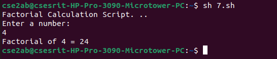

### date+%D command output

### date+%T command output

### date+%Y command output

### date+%H command output

### cal command output

### cal year command output

### cat command output
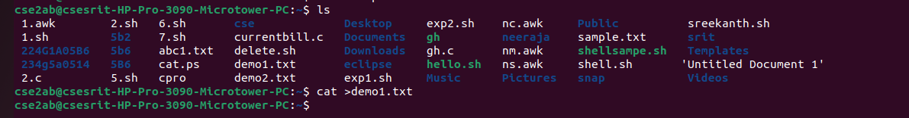

### echo command output

### mv command output

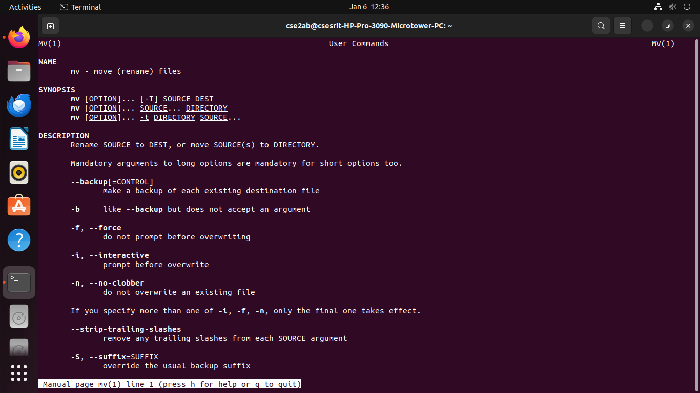
### rmdir command output
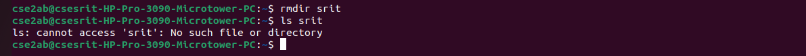
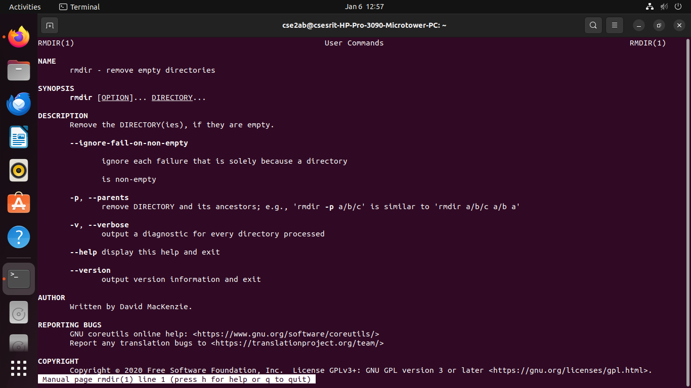
### rm command output

### tty command output

### who command output
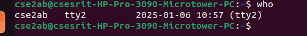

### uname command output

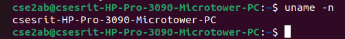
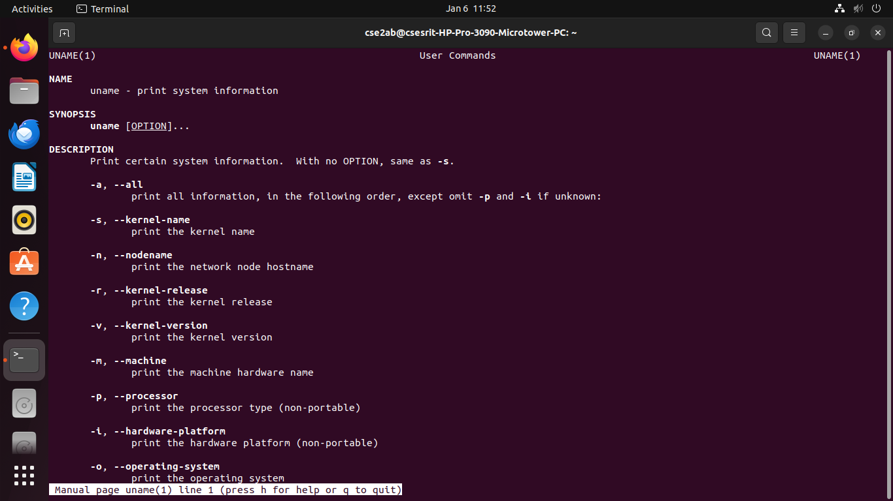
### mkdir command output
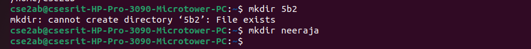
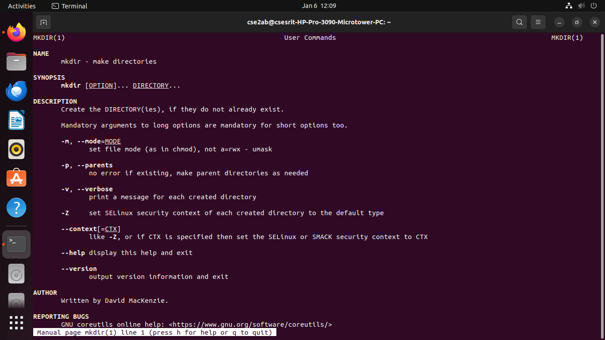
### chmod command output

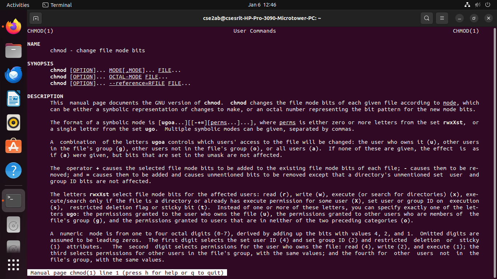
### cd command output

### ls command output

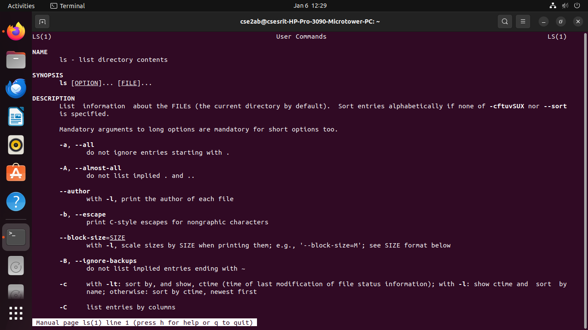
### cmp command output

### touch command output
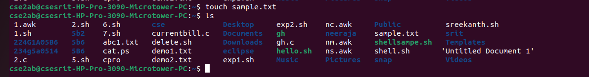
### who am i command output

### bc command output

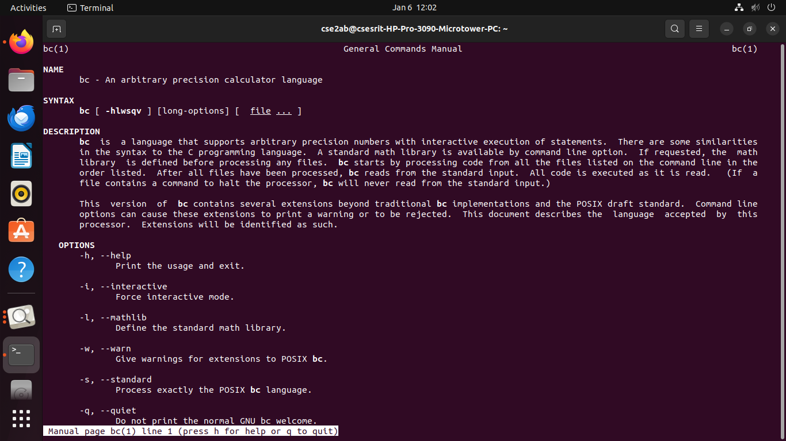
### cp command output

### pwd command output

