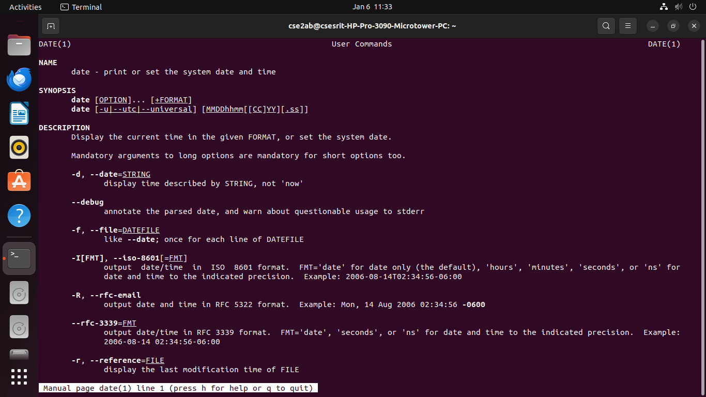
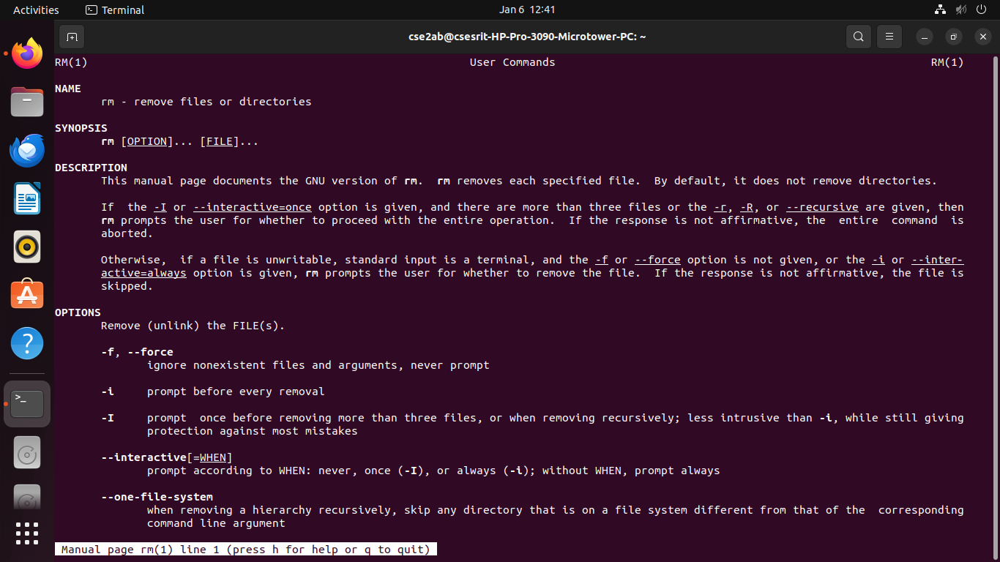
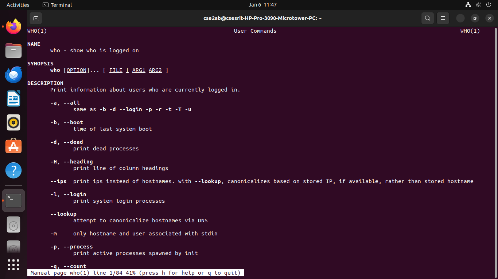

# OS-LAB
operating system lab
#BASIC LINUX COMMANDS
##General command outputs
### date command output

### date+%D command output

### date+%T command output

### date+%Y command output

### date+%H command output

### cal command output

### cal year command output

### cat command output

### echo command output

### mv command output

### rmdir command output

### rm command output

### tty command output

### who command output

### uname command output

### mkdir command output

### chmod command output

### cd command output

### ls command output

### cmp command output

### touch command output

### who am i command output

### bc command output

### cp command output

### pwd command output

